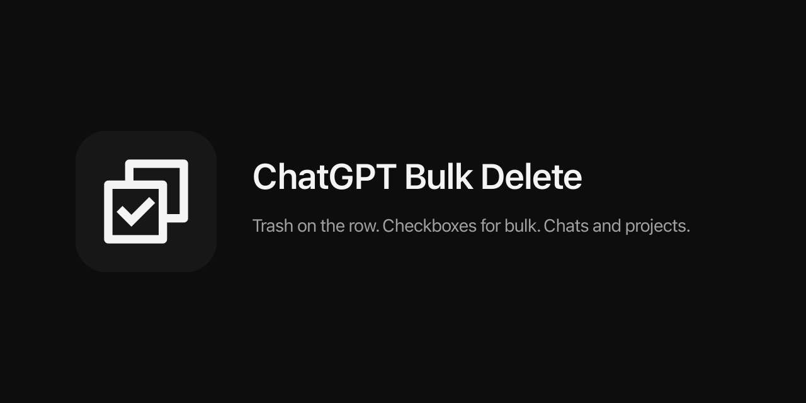

# ChatGPT Bulk Delete

[English](#chatgpt-bulk-delete) · [中文](#中文)

Delete chats and projects from the ChatGPT sidebar.

ChatGPT keeps Delete inside **•••**. This extension puts a trash icon on the row, next to edit and more, and adds checkboxes when you want to clear many chats at once.

  

## Use

- **One chat or one project:** hover the row, click the trash next to edit / •••
- **Many chats:** click the select icon beside Edit, check the ones you want (Shift-click a range), click trash

Nothing else is added to the page. No popup, no floating bar.

## Install

Not on the Chrome Web Store. Load it unpacked:

1. Download the [latest ZIP](https://github.com/EvilIrving/chatgpt-bulk-delete/releases/latest) and unzip it, or clone this repo
2. Open `chrome://extensions`
3. Enable **Developer mode**
4. **Load unpacked** → the folder that contains `manifest.json`
5. Open [chatgpt.com](https://chatgpt.com) and refresh

Chrome, Edge, Arc, Brave.

## Privacy

Runs only on `chatgpt.com` and `chat.openai.com`. No `storage`, `identity`, or extra host permissions. Deletes use your existing ChatGPT session. Nothing is sent to the author. [`content.js`](content.js) is the whole feature.

## Notes

- Unofficial. Not affiliated with OpenAI.
- ChatGPT sidebar markup changes. When the buttons vanish, the selectors in `content.js` need a patch.
- Chat delete calls ChatGPT's own API. Project delete tries that API, then the native menu if OpenAI moved the endpoint.
- Deleted items follow OpenAI's retention rules, same as deleting them by hand.

MIT. Icons: [Remix Icon](https://remixicon.com).

If this cuts the cleanup grind, a star makes the repo easier to find.

---

## 中文

ChatGPT 侧边栏里，删除藏在 **•••** 里，只能一条一条点。这个扩展把垃圾桶直接放在编辑 / 更多旁边，对话和项目都是。清很多对话时，点编辑旁的多选，勾上，再点删除。

页面上不加说明、不加浮层、不加弹窗。

### 用法

- **删一条对话或一个项目：** 悬停那一行，点编辑 / ••• 旁边的垃圾桶
- **删很多对话：** 点「编辑」旁的多选图标，勾选（Shift 连选），点垃圾桶

### 安装

还没上架 Chrome 商店。用「加载已解压的扩展程序」：

1. 下载 [最新 ZIP](https://github.com/EvilIrving/chatgpt-bulk-delete/releases/latest) 并解压，或 clone 本仓库
2. 打开 `chrome://extensions`
3. 打开「开发者模式」
4. 「加载已解压的扩展程序」→ 选中里面有 `manifest.json` 的目录
5. 打开 [chatgpt.com](https://chatgpt.com) 并刷新

只在 ChatGPT 官网运行。没有额外权限，没有统计，请求只发给 ChatGPT。非正式产品，与 OpenAI 无关。
