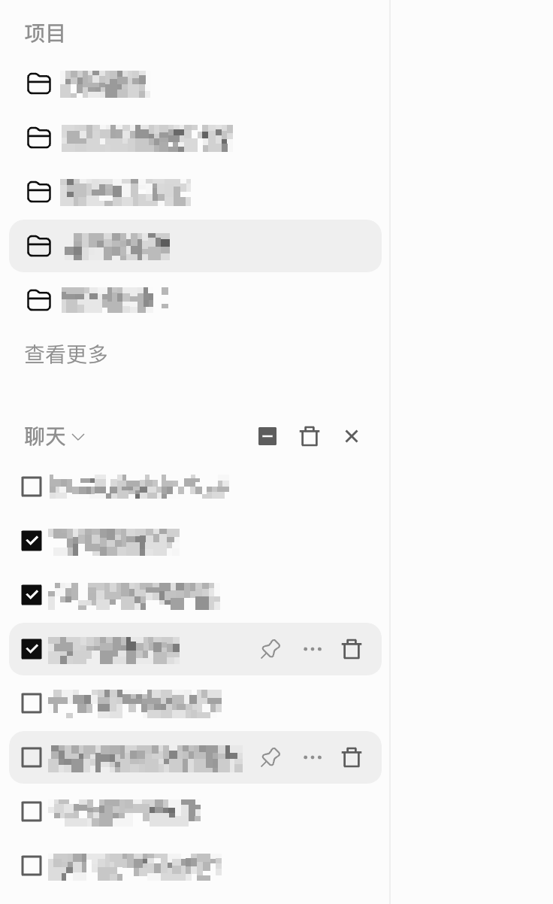

# ChatGPT Bulk Delete

[English](README.md) · [中文](README.zh-CN.md)

Chrome extension to bulk delete ChatGPT chats, conversation history, and projects from the sidebar on chatgpt.com.

ChatGPT keeps Delete inside **•••**. This extension puts a trash icon on the row, next to edit and more, and adds checkboxes when you want to clear many chats at once.

  

## Use

- **One chat or one project:** hover the row, click the trash next to edit / •••
- **Many chats:** click the select icon beside Edit, check the ones you want (Shift-click a range), click trash

Nothing else is added to the page. No popup, no floating bar.

## Install

Not on the Chrome Web Store. Load it unpacked:

1. Download the [latest ZIP](https://github.com/EvilIrving/chatgpt-bulk-delete/releases/latest) and unzip it, or clone this repo
2. Open `chrome://extensions`
3. Enable **Developer mode**
4. **Load unpacked** → the folder that contains `manifest.json`
5. Open [chatgpt.com](https://chatgpt.com) and refresh

Chrome, Edge, Arc, Brave.

## Privacy

Runs only on `chatgpt.com` and `chat.openai.com`. No `storage`, `identity`, or extra host permissions. Deletes use your existing ChatGPT session. Nothing is sent to the author. [`content.js`](content.js) is the whole feature.

## Notes

- Unofficial. Not affiliated with OpenAI.
- ChatGPT sidebar markup changes. When the buttons vanish, the selectors in `content.js` need a patch.
- Chat delete calls ChatGPT's own API. Project delete tries that API, then the native menu if OpenAI moved the endpoint.
- Deleted items follow OpenAI's retention rules, same as deleting them by hand.

MIT. Icons: [Remix Icon](https://remixicon.com).

If this cuts the cleanup grind, a star makes the repo easier to find.
